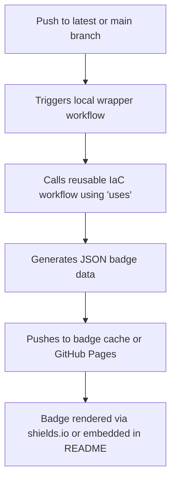
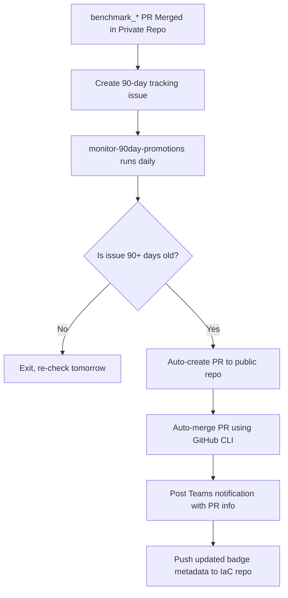

# GitHub Windows IaC

Infrastructure as Code (IaC) modules and automation for use with the Lockdown Enterprise (LE) Windows-based pipelines. This central repository supports Windows benchmarking, deployment automation, and security hardening for CI workflows using Terraform (OpenTofu) and Ansible.

---

## 📦 Features

- Centralized IaC logic for all Windows benchmark pipelines (CIS/STIG)
- Dynamic provisioning of Hyper-V Windows runners using OpenTofu
- Self-hosted runner workflows with automatic Terraform + Ansible flow
- GPO testing support via alternate variable files (e.g., `WIN2022GPO.tfvars`)
- Discord onboarding notifications for first-time contributors
- Shared GitHub Actions workflows for badge export and testing
- Support for local testing of IaC outside GitHub Actions

---

## 🔐 Required Secrets

These secrets must be configured under `Settings → Secrets → Actions` (repo or org level):

| Secret Name              | Description                                     |
|--------------------------|-------------------------------------------------|
| `AZURE_AD_CLIENT_ID`     | Azure AD App client ID                          |
| `AZURE_AD_CLIENT_SECRET` | Azure AD App secret                             |
| `AZURE_AD_TENANT_ID`     | Azure tenant ID                                 |
| `AZURE_SUBSCRIPTION_ID`  | Azure subscription ID                           |
| `WIN_USERNAME`           | Windows admin username used during provisioning |
| `WIN_PASSWORD`           | Password for the above user                     |

### 🔧 Local Testing

Export these as environment variables:

```bash
export WIN_USERNAME="your_username"
export WIN_PASSWORD="your_password"
export AZURE_AD_CLIENT_ID="client_id"
export AZURE_AD_CLIENT_SECRET="secret"
export AZURE_AD_TENANT_ID="tenant_id"
export AZURE_SUBSCRIPTION_ID="subscription_id"
```

---

## 📘 Repository Variables (Required)

These must be added under `Settings → Actions → Variables` in benchmark repos (e.g., `Windows-2022-CIS`):

| Variable Name             | Description                                                                 |
|---------------------------|-----------------------------------------------------------------------------|
| `ANSIBLE_RUNNER_VERSION`  | Specific version of Ansible to use during pipeline execution                |
| `BENCHMARK_TYPE`          | Type of benchmark to apply (`CIS` or `STIG`)                                |
| `ENABLE_DEBUG`            | When `true`, outputs Ansible inventory and Terraform logs                   |
| `GPO_OSVAR`               | OS variant used for Group Policy testing (e.g., `WIN2022GPO`)               |
| `IAC_BRANCH`              | Branch name of the IaC repo to check out (e.g., `self_hosted`)              |
| `OSVAR`                   | OS variant under test (e.g., `WIN2022`)                                     |

---

## 🏗️ IaC Modules

This repo uses [OpenTofu](https://opentofu.org/) to provision Windows test runners locally or inside GitHub Actions for compliance validation.

### Terraform Files

| File                | Description                                                               |
|---------------------|---------------------------------------------------------------------------|
| `main.tf`           | Creates Hyper-V-based Windows VMs with required networking and provisioning logic |
| `vars.tf`           | Defines all input variables used by main Terraform plan                    |
| `WIN2022.tfvars`    | Variable file for standard Windows Server 2022 runner setup                |
| `WIN2022GPO.tfvars` | GPO testing variant for Windows Server 2022                               |

---

## ⚙️ Workflow Overview

This repo is used by Windows benchmark pipelines to dynamically manage test infrastructure and execute compliance tests.

<details> <summary>🖼️ Click to expand fixed Mermaid diagram</summary> <pre><code>```mermaid graph TD; A[Benchmark Pipeline] --> B[Load windows_benchmark_testing] B --> C[Import repo-level variables] C --> D[STEP - Welcome Message] D --> E[Send Discord Invite (if first PR)] C --> F[STEP - Build testing pipeline] F --> G[Start GitHub runner (Ubuntu)] G --> H[Import IaC repo + PR source] H --> I[Load IaC logic (this repo)] I --> J[Load Windows credentials] J --> K[Run Terraform steps] K --> L[Init Terraform] L --> M[Validate Terraform] M --> N[Apply Terraform - Provision Host] N --> O[Wait 60s if debug enabled] O --> P[Run Ansible playbook] P --> Q[Teardown: Terraform destroy] ```</code></pre> </details>

---

## 🖥️ Run Locally (Test Terraform + Ansible)

```bash
export BENCHMARK_TYPE="CIS"
export OSVAR="WIN2022"
export TF_VAR_repository="${OSVAR}-${BENCHMARK_TYPE}"
export TF_VAR_BENCHMARK_TYPE="${BENCHMARK_TYPE}"

terraform init
terraform validate
terraform apply -var-file="WIN2022.tfvars" --auto-approve
terraform destroy -var-file="WIN2022.tfvars" --auto-approve
```

---

## 🔁 Reusable GitHub Actions Workflows

This repository (`github_windows_IaC`) maintains **shared GitHub Actions workflows** that are reused by Windows benchmark repos to manage badge exports and automation logic.

### 📂 Available Shared Workflows

| Workflow Filename                | Purpose                                       |
|----------------------------------|-----------------------------------------------|
| `.github/workflows/export_badges_private.yml` | Used in **private** repos for badge JSON export |
| `.github/workflows/export_badges_public.yml`  | Used in **public** repos for shields.io badge endpoints |

### 🧩 Usage in Benchmark Repositories

Benchmark repos include a wrapper workflow like:

```yaml
# .github/workflows/export_badges_private.yml
name: Export Badges to Private Repo
on:
  push:
    branches: [ latest ]
jobs:
  export-badges:
    uses: ansible-lockdown/github_windows_IaC/.github/workflows/export_badges_private.yml@main
    secrets:
      GH_TOKEN: ${{ secrets.GITHUB_TOKEN }}
      BADGE_PUSH_TOKEN: ${{ secrets.BADGE_PUSH_TOKEN }}
```

> The reusable logic lives in the `github_windows_IaC` repo. This makes badge generation portable and consistent.

---

### 🔒 Badge Secret Note

| Secret Name        | Where Needed   | Notes                                                              |
|--------------------|----------------|---------------------------------------------------------------------|
| `BADGE_PUSH_TOKEN` | 🔒 Private Repos | Must be set **manually** even if it exists at the org level         |
| `GH_TOKEN`         | All repos       | Provided automatically by GitHub Actions                           |

---

### 🧭 Workflow Flow



---

### 🧷 Recommended Badge Format

```markdown
[](https://results.pre-commit.ci/latest/github/ansible-lockdown/Windows-2022-CIS/devel)
```

---

## 🧩 Contributing

Pull requests are welcome. When you open your first PR, a Discord invite will be sent automatically (if enabled). Ensure your repo is configured with the appropriate variables and secrets to execute workflows.

---

## 🏷️ Badge Types and Their Sources

This repository supports a wide variety of badges across **public** and **private** benchmark repositories. These badges serve different purposes and come from different systems.

| Badge Type                    | Source System                  | Example Badge | Notes |
|------------------------------|--------------------------------|----------------|-------|
| **GitHub Stats (Stars/Forks)** | GitHub (static links)         |  | Hardcoded to specific repo/org |
| **Twitter & Discord**        | External services              |  | Hardcoded link or ID |
| **License Badge**            | GitHub                        |  | Hardcoded, dynamic on GitHub |
| **Lint Tools (yamllint, ansible-lint)** | Hardcoded manually            |  | Always present (not dynamic) |
| **GitHub Actions Status**    | GitHub Workflow Badge URLs     | [](https://github.com/ansible-lockdown/Windows-2019-CIS/actions/workflows/main_pipeline_validation.yml) | Dynamic, GitHub-managed |
| **Commits, Issues, PRs**     | GitHub                         |  | Dynamic, GitHub-managed |
| **Pre-Commit CI**            | IaC Badge JSON (hosted)        | [](https://results.pre-commit.ci/latest/github/ansible-lockdown/Windows-2019-CIS/devel) | 🔄 Updated via IaC workflow |
| **Benchmark Version Badges** | IaC Badge JSON                 |  | 🔄 Dynamic IaC badge |
| **Private Repo Badges**      | IaC Badge JSON                 |  | 🔐 Internal subscribers only |
| **Release Branch**           | Hardcoded or IaC badge         |  / IaC endpoint | Sometimes manually added |

---

## 🧰 Badge Integration Guidance

- **Dynamic badges** use `.json` files hosted in the `github_windows_IaC` `badges/` folder.
- They are updated using the [`export_badges_public.yml`](https://github.com/ansible-lockdown/github_windows_IaC/blob/main/.github/workflows/export_badges_public.yml) and `export_badges_private.yml` workflows.
- Public repos use pre-built shields.io URLs.
- Private repos consume the same badge format but must manually set the `BADGE_PUSH_TOKEN`.

---

## ✅ Recommended Placement in README.md

You can structure your badge sections like this:

```markdown
## Public Repository 📣

  
  
  
[](...)  
  
[](...)  
...

## Subscriber Release Information 🔐

  
[](...)  
...
```

---

## 📈 Benchmark Tracker & Teams Notifications

The `github_windows_IaC` repo contains a shared workflow that automates **benchmark version tracking** across private repositories. It ensures that once a benchmark hits the 90-day age milestone in a private repo, it gets **auto-promoted** to the public repository and notifies stakeholders via **Microsoft Teams**.

---

### 🧩 Workflow Files

| Workflow Name                 | Description                                                                 |
|------------------------------|-----------------------------------------------------------------------------|
| `benchmark-tracker.yml`      | Triggered when a PR from `benchmark_*` is merged into a private repo. Creates a 90-day tracking issue. |
| `monitor-90day-promotions.yml` | Scheduled job that checks the age of each tracked issue. If it's 90+ days, a PR is created to promote the version to the public repo. Also posts a message to Teams. |

---

### 🔐 Required Secrets

| Secret Name            | Required In         | Description                                                        |
|------------------------|----------------------|--------------------------------------------------------------------|
| `GH_TOKEN`             | All repos            | Required for GitHub CLI operations (auto PR, comment, merge, etc.) |
| `TEAMS_WEBHOOK_URL`    | All repos (private & IaC) | Used to send Teams Adaptive Card notifications                     |
| `BADGE_PUSH_TOKEN`     | IaC & private repos  | Required to push badge data post-promotion (already documented)    |

> These secrets must be added under: `Settings → Secrets → Actions`

---

### 🪄 How It Works



---

### 💬 Example Teams Notification

The workflow sends an Adaptive Card like:

```
Benchmark Auto-Promoted ✅
🔁 From: Private-Windows-2022-CIS (benchmark_v2.0.0)
🚀 To: Windows-2022-CIS (main branch)
📅 Reason: 90-day release threshold met
```

Teams webhook must support HTTP POST with JSON Adaptive Card payloads (used with Microsoft Power Automate or Flow connectors).

---

### 🛠 Setup Instructions

1. **Add the required secrets** (`TEAMS_WEBHOOK_URL`, `GH_TOKEN`) to your private repo and/or org.
2. **Include `benchmark-tracker.yml`** in the private repo.
3. Ensure `monitor-90day-promotions.yml` is scheduled from the IaC repo or a central `.github` runner.
4. Customize the Teams card endpoint and branding if needed (card JSON is in the workflow file).

---

## 🔍 Benchmark Tracker Workflow Details

This section breaks down the logic of the benchmark tracking and promotion system used to ensure timely updates from private to public repos.

---

### 🐧 Linux Benchmark Badge Support

This repository also acts as the **central badge hub** for Linux-based benchmark pipelines in addition to Windows.

- All badge JSON files for **Linux CIS** and **Linux STIG** benchmarks are written to the `badges/` directory in this repo
- The same export workflows (`export_badges_public.yml`, `export_badges_private.yml`) handle both **Windows** and **Linux** badge publication
- Example: A benchmark like `Ubuntu-22.04-CIS` will have badges stored at:

```
https://ansible-lockdown.github.io/github_windows_IaC/badges/Ubuntu-22.04-CIS/pre-commit-ci.json
```

> This keeps badge generation consistent and centralized across all platforms.

---

### 📜 `benchmark-tracker` Workflow

Triggered when a pull request from a branch matching `benchmark_*` is merged into the `latest` branch of a **Private** repo.

#### 🔄 What it does:

1. **Extract version from PR branch name**
   - Example: `benchmark_v2.0.0` becomes `v2.0.0`
2. **Create a GitHub issue** in the same repo with a 90-day countdown
3. **Assign labels**, version tags, and metadata to the issue
4. **Post a confirmation comment** in the PR for traceability

This tracks the need to promote this version publicly after 90 days.

---

### ⏱ `monitor-90day-promotions` Workflow

Runs daily from the **IaC repo**. Monitors issues created by the tracker workflow.

#### 🔄 What it does:

1. **Scan all private repos** for open issues labeled as benchmark trackers
2. **Parse the issue body** to extract the version, repo name, and date created
3. **Calculate the age of each issue**
4. If the issue is **older than 90 days**:
   - Clones the corresponding **public repo**
   - Creates a PR to add the benchmark version to the `main` branch
   - Uses `gh pr create` and `gh pr merge` to automate promotion
   - Pushes new badge files to `github_windows_IaC`
   - Sends a **Teams notification** with summary info
   - Closes the original issue with a comment

> If the issue is **not** yet 90 days old, it is skipped and checked again on the next scheduled run.

---

### 🛠️ Code Highlights

Each step is modularized inside the workflow YAML:

- `benchmark-tracker.yml`
  - `- name: Detect PR branch and extract version`
  - `- name: Create 90-day tracking issue`
  - `- name: Label and annotate PR`
- `monitor-90day-promotions.yml`
  - `- name: Search for benchmark tracker issues`
  - `- name: Compare age against 90-day threshold`
  - `- name: Promote version if qualified`
  - `- name: Send Teams notification via webhook`
  - `- name: Update badge JSON in IaC`


---
