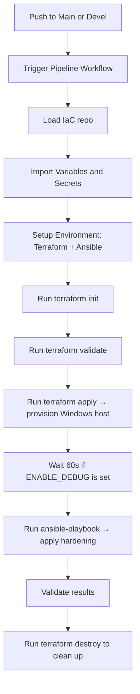
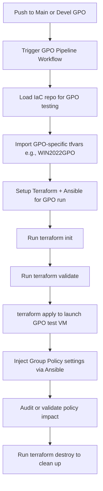
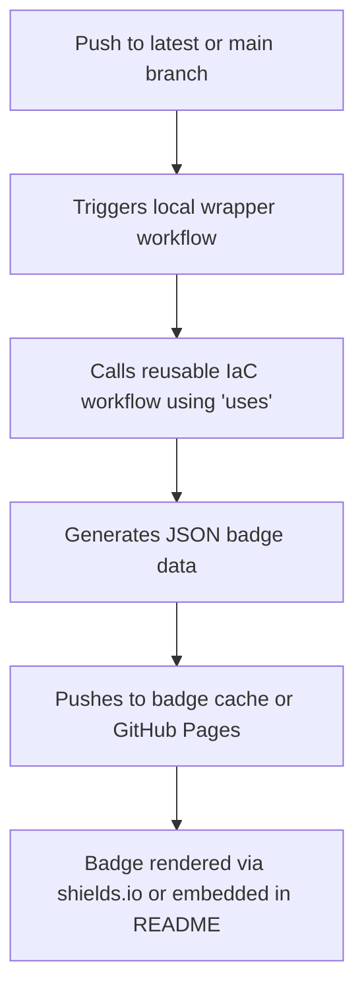

# GitHub Windows IaC

Infrastructure as Code (IaC) modules and automation for use with the Lockdown Enterprise (LE) Windows-based pipelines. This central repository supports Windows benchmarking, deployment automation, and security hardening for CI workflows using Terraform (OpenTofu) and Ansible.

---

## 📦 Features

- Centralized IaC logic for all Windows benchmark pipelines (CIS/STIG)
- Dynamic provisioning of Hyper-V Windows runners using OpenTofu
- Self-hosted runner workflows with automatic Terraform + Ansible flow
- GPO testing support via alternate variable files (e.g., `WIN2022GPO.tfvars`)
- Discord onboarding notifications for first-time contributors
- Shared GitHub Actions workflows for badge export and testing
- Support for local testing of IaC outside GitHub Actions

---

## 🔐 Required Secrets

These secrets must be configured under `Settings → Secrets → Actions` (repo or org level):

| Secret Name              | Description                                     |
|--------------------------|-------------------------------------------------|
| `AZURE_AD_CLIENT_ID`     | Azure AD App client ID                          |
| `AZURE_AD_CLIENT_SECRET` | Azure AD App secret                             |
| `AZURE_AD_TENANT_ID`     | Azure tenant ID                                 |
| `AZURE_SUBSCRIPTION_ID`  | Azure subscription ID                           |
| `WIN_USERNAME`           | Windows admin username used during provisioning |
| `WIN_PASSWORD`           | Password for the above user                     |

### 🔧 Local Testing

Export these as environment variables:

```bash
export WIN_USERNAME="your_username"
export WIN_PASSWORD="your_password"
export AZURE_AD_CLIENT_ID="client_id"
export AZURE_AD_CLIENT_SECRET="secret"
export AZURE_AD_TENANT_ID="tenant_id"
export AZURE_SUBSCRIPTION_ID="subscription_id"
```

---

## 📘 Repository Variables (Required)

These must be added under `Settings → Actions → Variables` in benchmark repos (e.g., `Windows-2022-CIS`):

| Variable Name             | Description                                                                 |
|---------------------------|-----------------------------------------------------------------------------|
| `ANSIBLE_RUNNER_VERSION`  | Specific version of Ansible to use during pipeline execution                |
| `BENCHMARK_TYPE`          | Type of benchmark to apply (`CIS` or `STIG`)                                |
| `ENABLE_DEBUG`            | When `true`, outputs Ansible inventory and Terraform logs                   |
| `GPO_OSVAR`               | OS variant used for Group Policy testing (e.g., `WIN2022GPO`)               |
| `IAC_BRANCH`              | Branch name of the IaC repo to check out (e.g., `self_hosted`)              |
| `OSVAR`                   | OS variant under test (e.g., `WIN2022`)                                     |

---

## 🏗️ IaC Modules

This repo uses [OpenTofu](https://opentofu.org/) to provision Windows test runners locally or inside GitHub Actions for compliance validation.

### Terraform Files

| File                | Description                                                               |
|---------------------|---------------------------------------------------------------------------|
| `main.tf`           | Creates Hyper-V-based Windows VMs with required networking and provisioning logic |
| `vars.tf`           | Defines all input variables used by main Terraform plan                    |
| `WIN2022.tfvars`    | Variable file for standard Windows Server 2022 runner setup                |
| `WIN2022GPO.tfvars` | GPO testing variant for Windows Server 2022                               |

---

## 🧪 Pipeline Validation Workflows

This repository supports automated validation pipelines that run on every push to `main` or `devel` branches of Windows benchmark repositories. These workflows are split by purpose:

- Standard validation (`main_pipeline_validation.yml`, `devel_pipeline_validation.yml`)
- Group Policy (GPO) validation (`main_pipeline_validation_gpo.yml`, `devel_pipeline_validation_gpo.yml`)

---

### 🧼 Standard Benchmark Validation

These workflows provision a fresh Windows environment, apply the benchmark using Ansible, and validate compliance.

#### Trigger Files:
- `.github/workflows/main_pipeline_validation.yml`
- `.github/workflows/devel_pipeline_validation.yml`



---

### 🏛 GPO Benchmark Validation

These workflows use a GPO-specific configuration to validate settings enforced through Group Policy Objects.

#### Trigger Files:
- `.github/workflows/main_pipeline_validation_gpo.yml`
- `.github/workflows/devel_pipeline_validation_gpo.yml`



Each workflow is fully integrated with badge export automation and can be extended with extra validation stages (e.g., log parsing, custom output diffing) as needed.

---

## 🖥️ Run Locally (Test Terraform + Ansible)

```bash
export BENCHMARK_TYPE="CIS"
export OSVAR="WIN2022"
export TF_VAR_repository="${OSVAR}-${BENCHMARK_TYPE}"
export TF_VAR_BENCHMARK_TYPE="${BENCHMARK_TYPE}"

terraform init
terraform validate
terraform apply -var-file="WIN2022.tfvars" --auto-approve
terraform destroy -var-file="WIN2022.tfvars" --auto-approve
```

---

## 🔁 Reusable GitHub Actions Workflows

This repository (`github_windows_IaC`) maintains **shared GitHub Actions workflows** that are reused by Windows benchmark repos to manage badge exports and automation logic.

### 📂 Available Shared Workflows

| Workflow Filename                | Purpose                                       |
|----------------------------------|-----------------------------------------------|
| `.github/workflows/export_badges_private.yml` | Used in **private** repos for badge JSON export |
| `.github/workflows/export_badges_public.yml`  | Used in **public** repos for shields.io badge endpoints |

### 🧩 Usage in Benchmark Repositories

Benchmark repos include a wrapper workflow like:

```yaml
# .github/workflows/export_badges_private.yml
name: Export Badges to Private Repo
on:
  push:
    branches: [ latest ]
jobs:
  export-badges:
    uses: ansible-lockdown/github_windows_IaC/.github/workflows/export_badges_private.yml@main
    secrets:
      GH_TOKEN: ${{ secrets.GITHUB_TOKEN }}
      BADGE_PUSH_TOKEN: ${{ secrets.BADGE_PUSH_TOKEN }}
```

> The reusable logic lives in the `github_windows_IaC` repo. This makes badge generation portable and consistent.

---

### 🔒 Badge Secret Note

| Secret Name        | Where Needed   | Notes                                                              |
|--------------------|----------------|---------------------------------------------------------------------|
| `BADGE_PUSH_TOKEN` | 🔒 Private Repos | Must be set **manually** even if it exists at the org level         |
| `GH_TOKEN`         | All repos       | Provided automatically by GitHub Actions                           |

---

### 🧭 Workflow Flow



---

### 🧷 Recommended Badge Format

```markdown
[](https://results.pre-commit.ci/latest/github/ansible-lockdown/Windows-2022-CIS/devel)
```

---

## 🧩 Contributing

Pull requests are welcome. When you open your first PR, a Discord invite will be sent automatically (if enabled). Ensure your repo is configured with the appropriate variables and secrets to execute workflows.

---

## 🏷️ Badge Types and Their Sources

This repository supports a wide variety of badges across **public** and **private** benchmark repositories. These badges serve different purposes and come from different systems.

| Badge Type                    | Source System                  | Example Badge | Notes |
|------------------------------|--------------------------------|----------------|-------|
| **GitHub Stats (Stars/Forks)** | GitHub (static links)         |  | Hardcoded to specific repo/org |
| **Twitter & Discord**        | External services              |  | Hardcoded link or ID |
| **License Badge**            | GitHub                        |  | Hardcoded, dynamic on GitHub |
| **Lint Tools (yamllint, ansible-lint)** | Hardcoded manually            |  | Always present (not dynamic) |
| **GitHub Actions Status**    | GitHub Workflow Badge URLs     | [](https://github.com/ansible-lockdown/Windows-2019-CIS/actions/workflows/main_pipeline_validation.yml) | Dynamic, GitHub-managed |
| **Commits, Issues, PRs**     | GitHub                         |  | Dynamic, GitHub-managed |
| **Pre-Commit CI**            | IaC Badge JSON (hosted)        | [](https://results.pre-commit.ci/latest/github/ansible-lockdown/Windows-2019-CIS/devel) | 🔄 Updated via IaC workflow |
| **Benchmark Version Badges** | IaC Badge JSON                 |  | 🔄 Dynamic IaC badge |
| **Private Repo Badges**      | IaC Badge JSON                 |  | 🔐 Internal subscribers only |
| **Release Branch**           | Hardcoded or IaC badge         |  / IaC endpoint | Sometimes manually added |

---

## 🧰 Badge Integration Guidance

- **Dynamic badges** use `.json` files hosted in the `github_windows_IaC` `badges/` folder.
- They are updated using the [`export_badges_public.yml`](https://github.com/ansible-lockdown/github_windows_IaC/blob/main/.github/workflows/export_badges_public.yml) and `export_badges_private.yml` workflows.
- Public repos use pre-built shields.io URLs.
- Private repos consume the same badge format but must manually set the `BADGE_PUSH_TOKEN`.

---

## ✅ Recommended Placement in README.md

You can structure your badge sections like this:

```markdown
## Public Repository 📣

  
  
  
[](...)  
  
[](...)  
...

## Subscriber Release Information 🔐

  
[](...)  
...
```

---

## 📈 Benchmark Tracker & Teams Notifications

The `github_windows_IaC` repo contains reusable workflows to track and promote benchmark versions from private repositories to public, with automated notifications sent to Microsoft Teams.

---

### 🧩 Workflow Files

| Workflow Name                     | Description                                                                 |
|----------------------------------|-----------------------------------------------------------------------------|
| `benchmark_track.yml`            | Triggered when a new benchmark version is pushed to a private repo. Creates a 3-day tracking issue and posts to Teams. |
| `benchmark_promote.yml`          | Scheduled job that checks tracked issues. Sends reminders and promotes benchmarks after 3–5 days. |
| `central_benchmark_tracker.yml` | Orchestrates both workflows via a single `workflow_call` action.            |

---

### 🔐 Required Secrets

| Secret Name         | Required In         | Description                                                        |
|---------------------|----------------------|--------------------------------------------------------------------|
| `GH_TOKEN`          | All repos            | Required for GitHub CLI operations (PRs, comments, merges)         |
| `TEAMS_WEBHOOK_URL` | Private & IaC repos  | Used to send Teams Adaptive Card notifications                     |
| `BADGE_PUSH_TOKEN`  | IaC & private repos  | Required to push badge metadata and interact with repositories     |

> These secrets must be added under: `Settings → Secrets → Actions`

---

### 🪄 How It Works

```mermaid
graph TD;
  A[benchmark_* PR Merged in Private Repo] --> B[benchmark_track.yml creates tracking issue]
  B --> C[benchmark_promote.yml runs daily]
  C --> D{Is version already in Public?}
  D -- Yes --> E[Close issue, send "already promoted" card]
  D -- No --> F{Has it been 3–5 days?}
  F -- No --> G[Send reminder card to Teams]
  F -- Yes --> H[Auto-promote benchmark]
  H --> I[Create & merge PR to public repo]
  I --> J[Push updated badge metadata]
  J --> K[Send "benchmark promoted" Teams notification]
```

---

### 💬 Example Teams Notification

```
✅ Benchmark Auto-Promoted
🔁 From: Private-Windows-2022-CIS (v3.0.1)
🚀 To: Windows-2022-CIS (main branch)
📅 Reason: Auto-promoted after 3-day review
```

---

### 🛠 Setup Instructions

1. Add the required secrets to the private repo: `TEAMS_WEBHOOK_URL`, `BADGE_PUSH_TOKEN`, `GH_TOKEN`
2. Use the `central_benchmark_tracker.yml` in your benchmark repo's workflows
3. The `benchmark_promote.yml` workflow should run daily via schedule from the IaC repo
4. Customize the Teams card payload (optional)

---

### 📜 `benchmark_track.yml` Workflow

Triggered via `workflow_call` when a new benchmark version is pushed to `latest` in a Private repo.

#### 🔄 What it does:

- Extracts the benchmark version from the README
- Creates a tracking issue labeled `benchmark-3day`
- Sends a "Tracking Started" notification to Teams
- Validates that the public repo exists and has a `devel` branch

---

### ⏱ `benchmark_promote.yml` Workflow

Runs daily from the **IaC repo** or central runner.

#### 🔄 What it does:

- Loops through `benchmark-3day` issues in private repos
- Extracts version and age of each issue
- Sends a reminder card if the issue is on day 2, 3, or 4
- Closes issues that were manually promoted
- Auto-promotes issues that hit day 5:
  - Clones public repo
  - Creates and merges PR
  - Pushes updated badge files
  - Closes issue and notifies Teams
- Sends a daily recap summary to Teams with number of issues scanned, promoted, skipped, etc.

---

### 🛠️ Code Highlights

Each step is modular inside the YAML workflows:

- `benchmark_track.yml`
  - Extracts repo/version
  - Checks if public repo exists
  - Creates issue
  - Sends Teams card

- `benchmark_promote.yml`
  - Loads and audits issues
  - Sends reminders
  - Closes already promoted versions
  - Auto-promotes and merges to public
  - Posts Teams recap at end of run

---
